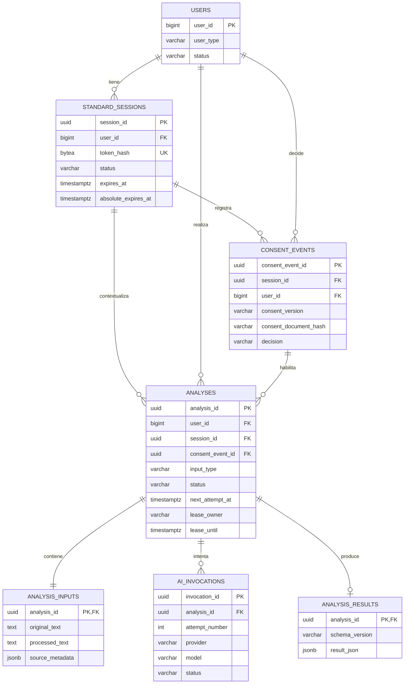
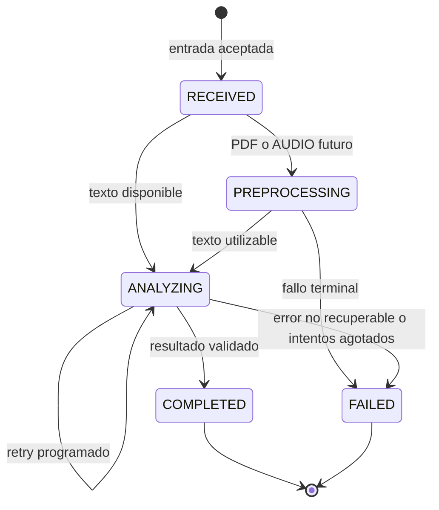

# Dominio de análisis — IDENTIPAT-IA

**Estado:** diseño F1.0 materializado en F1.1–F1.3  
**Versión:** 1.1  
**Última actualización:** 16 de septiembre de 2026  
**Alcance:** modelo vigente de sesión, consentimiento, análisis de texto, invocaciones de IA y resultado canónico. PDF y audio se incorporarán sobre este núcleo en F1.5 y F1.6.

## 1. Objetivo

Definir un núcleo único, durable y trazable para las consultas de propiedad intelectual realizadas por usuarios `STANDARD`.

El dominio debe explicar:

- cómo se mantiene una experiencia temporal sin convertirla en autenticación;
- cómo se registra y verifica el consentimiento;
- cómo una consulta conserva su entrada y lifecycle;
- cómo se diferencian los reintentos técnicos del análisis funcional;
- cómo se valida y persiste un único resultado canónico;
- cómo se recupera el trabajo después de fallos o reinicios;
- cómo PDF y audio podrán reutilizar el mismo núcleo.

F1.0 produjo el diseño conceptual. F1.1 materializó sesión y consentimiento; F1.2, la abstracción de IA generativa; y F1.3, el análisis de texto asíncrono y durable. Este documento describe el estado implementado y separa explícitamente las decisiones pendientes.

## 2. Decisiones confirmadas y límites

- Java/Spring Boot es dueño de sesión, consentimiento, análisis, persistencia, resultado e inferencia generativa.
- Angular consume los contratos Java y no accede directamente a PostgreSQL, Python ni al proveedor LLM.
- Python se reserva para preprocesamiento técnico futuro de PDF/audio.
- `ADMIN` es el único acceso autenticado mediante credenciales y JWT.
- `STANDARD` no recibe JWT, no utiliza contraseña y no tiene perfil ni historial visible.
- DNI/CE identifica o deduplica un registro; no autentica ni verifica la identidad real de quien opera el navegador.
- La sesión `STANDARD` es una capacidad temporal revocable y limitada a una experiencia de uso.
- El motor funcional es IA generativa; no existe un pipeline paralelo de NLP, embeddings, clasificadores o ML clásico.
- OpenAI es el adapter implementado actualmente mediante `GenerativeAiProvider`; Gemini u otros proveedores son extensiones futuras.
- La información funcional y técnica se conserva ampliamente durante el desarrollo para trazabilidad y evaluación.
- La persistencia interna no habilita un historial visible para `STANDARD` ni fija la política productiva de retención.
- Consentimiento y disclaimer son artefactos distintos. El consentimiento habilita el tratamiento y uso; el disclaimer institucional acompañará el resultado en F1.7.

## 3. Modelo del dominio vigente



`users` conserva su PK `BIGINT`. Las entidades nuevas usan UUID generados por Java, salvo las relaciones 1:1 que reutilizan `analysis_id` como PK/FK. Los UUID no son credenciales ni sustituyen el token opaco de sesión.

El agregado funcional principal es `Analysis`:

```text
Analysis
├── AnalysisInput              1:1
├── AiInvocation              1:N
└── AnalysisResult            0..1
```

La sesión, el usuario y el evento de consentimiento forman el contexto que autorizó su creación.

## 4. Sesión temporal STANDARD

### 4.1 Modelo implementado

Una sesión se representa mediante `StandardSession` y la tabla `standard_sessions`, con `session_id UUID` como PK interna.

El navegador no recibe el UUID. Recibe un token opaco aleatorio de 256 bits, codificado Base64URL y creado con un generador criptográficamente seguro. El backend conserva únicamente:

```text
HMAC-SHA-256(token, pepper de configuración)
```

en `token_hash`. El token en claro no se persiste ni debe aparecer en logs.

La separación cumple dos propósitos:

- `session_id` identifica relaciones internas;
- el token de alta entropía funciona como capacidad presentada por el navegador.

Conocer un UUID no permite utilizar una sesión.

### 4.2 Transporte

La sesión se transporta mediante una cookie propia, no mediante un token administrado por JavaScript.

| Atributo | Decisión vigente |
|---|---|
| `HttpOnly` | Siempre. Angular no lee el token. |
| `Secure` | Obligatorio en PROD; desactivable únicamente para HTTP local de DEV. |
| `SameSite` | `Lax`. |
| `Path` | Limitado a `/identipat-ia`. |
| Duración | Coherente con el TTL configurado del servidor. |

`SameSite` y CORS no sustituyen CSRF. Las mutaciones STANDARD implementadas utilizan `CookieCsrfTokenRepository`, cookie `XSRF-TOKEN`, header `X-XSRF-TOKEN` y el patrón SPA de Spring Security 6.2.

### 4.3 Lifecycle

Estados persistidos:

```text
ACTIVE → EXPIRED
ACTIVE → CLOSED
```

La sesión aplica dos límites:

- TTL de inactividad, renovado con actividad válida sin superar el límite absoluto;
- TTL absoluto, que nunca se amplía.

También puede cerrarse al detectar un usuario inactivo o una finalización explícita. `closed_at` y `close_reason` conservan la causa cuando corresponde.

La sesión no se convierte en JWT, no concede privilegios ADMIN y no permite recuperar sesiones anteriores desde la interfaz.

### 4.4 Invariantes físicas

La migración V2 garantiza:

- `token_hash` único;
- par `(session_id, user_id)` único para FKs compuestas;
- `expires_at > created_at`;
- `absolute_expires_at > created_at`;
- `expires_at <= absolute_expires_at`;
- estado limitado a `ACTIVE`, `EXPIRED` o `CLOSED`.

Las reglas adicionales —por ejemplo, que el usuario sea `STANDARD` y esté activo— se aplican en el servicio.

## 5. Consentimiento

`ConsentEvent` representa una decisión inmutable vinculada simultáneamente con la sesión y el usuario.

Campos relevantes:

| Campo | Propósito |
|---|---|
| `consent_event_id` | UUID de la evidencia. |
| `session_id`, `user_id` | Contexto que realizó la decisión. |
| `consent_version` | Versión lógica del documento. |
| `consent_document_hash` | SHA-256 hexadecimal del contenido aprobado. |
| `decision` | `ACCEPTED` o `REJECTED`. |
| `source` | Canal o fuente controlada. |
| `decided_at` | Instante de la decisión. |

La tabla impide asociaciones cruzadas mediante una FK compuesta a `(session_id, user_id)` y limita a una decisión por `(session_id, consent_version)`.

Antes de admitir un análisis, el backend verifica que exista una decisión `ACCEPTED` correspondiente tanto a la versión como al hash del documento vigente. La versión sola no es suficiente.

El `Analysis` conserva `consent_event_id`; por ello puede determinarse qué evidencia concreta habilitó su creación incluso después de que la sesión expire o cambie la versión vigente.

La evidencia no prueba la identidad real de quien opera el navegador. Permanece pendiente la confirmación funcional/legal sobre si el consentimiento debe obtenerse antes de persistir los datos personales del registro inicial.

## 6. Analysis como consulta funcional

`Analysis` representa una consulta funcional, no una llamada individual al proveedor.

Una regeneración solicitada explícitamente crea una nueva `Analysis`. Los reintentos automáticos, timeouts y respuestas inválidas del proveedor permanecen dentro de la misma consulta como varias `AiInvocation`.

### 6.1 Campos implementados

| Campo | Uso |
|---|---|
| `analysis_id` | UUID público del análisis. |
| `user_id` | Usuario STANDARD asociado. |
| `session_id` | Sesión propietaria y límite de acceso. |
| `consent_event_id` | Evidencia que habilitó el análisis. |
| `input_type` | `TEXT`, `PDF` o `AUDIO`. |
| `status` | Lifecycle funcional. |
| `created_at` | Recepción persistida. |
| `started_at` | Primer inicio de procesamiento. |
| `completed_at` | Éxito terminal. |
| `failed_at` | Fallo terminal. |
| `updated_at` | Última mutación relevante. |
| `failure_code`, `failure_message` | Fallo funcional saneado. |
| `next_attempt_at` | Instante desde el cual puede reintentarse. |
| `lease_owner`, `lease_until` | Propiedad temporal del trabajo. |

La migración V3 exige que `lease_owner` y `lease_until` sean ambos nulos o ambos no nulos. También exige el timestamp correspondiente cuando el estado es `COMPLETED` o `FAILED`.

### 6.2 Integridad de contexto

V3 utiliza FKs compuestas para garantizar que el análisis no pueda combinar accidentalmente:

- un usuario con la sesión de otro usuario;
- una sesión con un evento de consentimiento ajeno;
- un usuario con evidencia perteneciente a otro contexto.

```text
(session_id, user_id)
    → standard_sessions

(consent_event_id, session_id, user_id)
    → consent_events
```

Estas restricciones complementan las validaciones del servicio.

## 7. Datos de entrada

`analysis_inputs` es una tabla 1:1 con `analyses`, usando `analysis_id` como PK/FK.

Separarla mantiene liviana la fila operativa del análisis, evita arrastrar contenido voluminoso durante claims y permite incorporar tres tipos de entrada sin rediseñar el agregado.

| Campo | Uso |
|---|---|
| `analysis_id` | PK/FK del análisis. |
| `original_text` | Texto exactamente recibido para `TEXT`. |
| `processed_text` | Texto normalizado que se envía al proveedor. |
| `source_metadata` | Objeto JSONB con metadata técnica evolutiva. |
| `created_at` | Persistencia de la entrada. |
| `processed_at` | Disponibilidad del texto procesado. |

`source_metadata` debe ser un objeto JSON. No debe usarse como contenedor indiscriminado de información sensible.

Para `TEXT`, se conserva el original y se diferencia del texto técnicamente normalizado. Para PDF/audio, F1.5/F1.6 definirán storage, MIME, límites, OCR/STT y manejo del archivo original. La salida de esos procesos se persistirá como `processed_text` dentro de la misma estructura 1:1.

## 8. Invocaciones de IA

`AiInvocation` representa cada intento técnico contra un proveedor. Se separa de `Analysis` porque una consulta puede requerir múltiples intentos antes de producir un resultado válido o fallar definitivamente.

### 8.1 Campos implementados

| Grupo | Campos |
|---|---|
| Identidad | `invocation_id`, `analysis_id`, `attempt_number` |
| Estado | `status`, `retryable`, `created_at`, `completed_at` |
| Proveedor | `provider`, `model`, `provider_request_id` |
| Prompt | `prompt_id`, `prompt_version`, `template_hash`, `rendered_hash`, `rendered_prompt_snapshot` |
| Schema | `output_schema_id`, `output_schema_version` |
| Request | `request_parameters` |
| Respuesta | `raw_provider_response`, `structured_provider_response` |
| Uso | `input_tokens`, `output_tokens`, `total_tokens`, `token_usage` |
| Operación | `latency_ms`, `finish_reason` |
| Error | `error_code`, `error_message` |

`attempt_number` es positivo y único por análisis. Los hashes de template y prompt renderizado deben ser SHA-256 hexadecimales de 64 caracteres. Los conteos de tokens y la latencia no pueden ser negativos.

### 8.2 Estados

```text
STARTED
├── SUCCEEDED
├── FAILED
├── TIMED_OUT
├── INVALID_RESPONSE
└── ABANDONED
```

`ABANDONED` conserva la evidencia de un intento iniciado cuyo worker perdió el lease o desapareció antes de registrar una conclusión confiable.

Los códigos y mensajes de error deben estar saneados. No contienen stack traces, secretos, cookies ni payloads sin control.

### 8.3 Proveedor vigente

El adapter implementado actualmente es OpenAI. El dominio conserva `provider` y `model` como campos agnósticos, de modo que un adapter futuro —por ejemplo Gemini— no requiera rediseñar `Analysis` ni `AiInvocation`.

Las clases del SDK de OpenAI permanecen dentro del boundary del adapter y no atraviesan hacia el dominio.

### 8.4 Prompts, schemas y reproducibilidad

Cada invocación conserva:

- identificador y versión lógica del prompt;
- hash de la plantilla;
- hash y snapshot exacto del prompt renderizado;
- identificador y versión del schema esperado;
- parámetros de solicitud;
- proveedor y modelo efectivos.

Esto permite responder qué contrato y contenido exactos produjeron una salida histórica. Es reproducibilidad razonable, no determinismo: el proveedor o el modelo externo pueden cambiar con el tiempo.

El snapshot puede contener la descripción confidencial de una invención. Por ello es dato de dominio con acceso restringido, no contenido para logs ordinarios. Su conservación productiva debe revisarse en F2.1.

### 8.5 Respuestas `incomplete` o inválidas

Si el proveedor devuelve contenido que no cumple el contrato, la invocación termina como `INVALID_RESPONSE` y no genera `AnalysisResult`.

La implementación debe evolucionar para conservar toda metadata técnica segura disponible —modelo, usage, latencia, finish reason, detalles de respuesta incompleta y request ID— incluso cuando falle la extracción o validación del contenido.

## 9. Resultado canónico

`AnalysisResult` es el resultado funcional que Java valida y acepta. Se diferencia de:

- la respuesta cruda del proveedor;
- la interpretación estructurada previa a validación;
- cualquier intento técnico fallido.

`analysis_results` mantiene una relación 1:1 opcional con `analyses` mediante `analysis_id` como PK/FK.

| Campo | Uso |
|---|---|
| `analysis_id` | PK/FK del análisis completado. |
| `schema_version` | Versión lógica del contrato. |
| `result_json` | Objeto JSONB validado. |
| `created_at` | Instante de aceptación. |

Solo puede existir un resultado canónico por análisis. Una vez completado, no se sobrescribe para simular una regeneración; una nueva solicitud crea otra `Analysis`.

### 9.1 Envelope vigente

```text
AnalysisResult
├── schemaVersion
├── summary
├── patentabilityAssessment
│   ├── outcome
│   └── rationale
├── protectionOptions[]
│   ├── type
│   ├── applicability
│   └── rationale
├── observations[]
└── warnings[]
```

`patentabilityAssessment.outcome` utiliza:

- `POTENTIALLY_PATENTABLE`;
- `POTENTIALLY_NOT_PATENTABLE`;
- `INSUFFICIENT_INFORMATION`.

Es una conclusión orientativa, no una decisión oficial ni una probabilidad calibrada. No se incluye un porcentaje de confianza.

`protectionOptions[].type` admite:

- `INVENTION_PATENT`;
- `UTILITY_MODEL`;
- `INDUSTRIAL_DESIGN`;
- `DISTINCTIVE_SIGN`;
- `COPYRIGHT`;
- `OTHER`.

`applicability` utiliza `LIKELY`, `POSSIBLE` o `UNLIKELY`.

`warnings[]` contiene advertencias derivadas de la entrada o del diagnóstico; no contiene por defecto el disclaimer institucional.

### 9.2 Versionado

El contrato vigente usa una versión lógica como `analysis-result/1.0`. `schema_version` se conserva como columna y `schemaVersion` dentro del JSON; Java valida su coherencia.

Una evolución compatible incrementa la versión menor. Un cambio de significado, obligatoriedad o estructura requiere una versión mayor y adaptación explícita de consumidores. Los resultados históricos no se reescriben para aparentar que fueron generados con un contrato posterior.

F1.4 debe evolucionar el contrato jurídico-funcional antes de modificar sustancialmente el prompt. El envelope actual es suficiente para la vertical técnica, pero todavía no representa explícitamente todos los criterios jurídicos del diagnóstico definitivo.

## 10. Lifecycle de Analysis



`COMPLETED` y `FAILED` son terminales.

Para texto, `PREPROCESSING` se omite. Un retry no reinicia la consulta ni crea otra `Analysis`; crea la siguiente `AiInvocation` y mantiene el lifecycle funcional.

### 10.1 Timestamps

- `created_at`: entrada aceptada y persistida;
- `started_at`: primer inicio real del procesamiento;
- `updated_at`: última transición o actualización operativa;
- `completed_at`: obligatorio para `COMPLETED`;
- `failed_at`: obligatorio para `FAILED`.

### 10.2 Errores por nivel

| Nivel | Ejemplos | Persistencia |
|---|---|---|
| `Analysis` funcional | entrada no procesable, proveedor agotado, timeout definitivo, respuesta definitivamente inválida, error interno | `failure_code`, mensaje saneado y timestamp terminal |
| `AiInvocation` técnico | timeout individual, error de red, respuesta inválida, worker abandonado, error retryable | estado, código, mensaje, retryable, latencia y metadata disponible |

Una validación HTTP elemental puede responder `400` sin crear una `Analysis`. Si la entrada ya fue aceptada y persistida pero luego resulta no procesable, la consulta pasa a `FAILED` con un código funcional controlado.

## 11. Procesamiento asíncrono y recuperación

### 11.1 Contrato HTTP

`POST /analyses/text`:

1. valida sesión, CSRF, consentimiento y longitud;
2. persiste `Analysis(RECEIVED)` y `AnalysisInput(TEXT)`;
3. responde `202 Accepted` con el identificador.

`GET /analyses/{analysisId}`:

- resuelve la sesión STANDARD;
- verifica que el análisis pertenezca a esa sesión;
- devuelve estado, error público o resultado;
- no expone prompts, respuestas crudas ni metadata interna del proveedor.

### 11.2 Claim y lease

PostgreSQL es la fuente de verdad del trabajo asíncrono. El worker reclama filas mediante:

```sql
FOR UPDATE SKIP LOCKED
```

y registra `lease_owner` y `lease_until`.

El índice parcial `idx_analyses_claim` optimiza las consultas de claim sobre análisis `RECEIVED` o `ANALYZING` usando `next_attempt_at`, `lease_until` y `created_at`.

La llamada al proveedor nunca mantiene una transacción de base de datos abierta:

```text
TX 1: claim + lease
COMMIT

TX 2: AiInvocation STARTED
COMMIT

sin transacción DB: llamada al proveedor

TX 3: cerrar invocación + resultado + estado terminal
COMMIT
```

### 11.3 Retry

Un fallo retryable:

- cierra la invocación técnica con su evidencia;
- calcula y persiste `next_attempt_at`;
- libera el lease;
- no bloquea threads con `sleep`;
- permite que el poller retome la consulta posteriormente.

Cuando se agota la política de intentos o el error no es recuperable, la `Analysis` pasa a `FAILED`.

### 11.4 Recuperación

Si un worker desaparece, el lease vence. Un worker posterior puede reclamar el análisis, marcar la invocación `STARTED` previa como `ABANDONED` y crear un nuevo intento.

La semántica es *at-least-once*. Por ello, antes de producción debe garantizarse:

```text
lease duration >= provider timeout + margen operativo
```

La configuración actual debe validarse también en startup para impedir una relación insegura.

Cerca del vencimiento existe una carrera residual porque la transición terminal no se arbitra todavía mediante una actualización condicionada por propietario y vigencia del lease. Debe evaluarse un `UPDATE ... WHERE lease_owner = ? AND lease_until > now()` o locking optimista equivalente.

## 12. Persistencia física vigente

PostgreSQL normaliza los datos usados para integridad, operación y consulta frecuente. JSONB se reserva para estructuras evolutivas o específicas del proveedor.

| Tabla | Propósito | Claves e invariantes principales | Fase |
|---|---|---|---|
| `standard_sessions` | Capacidad temporal STANDARD | PK UUID; token HMAC único; FK a usuario; expiraciones coherentes | F1.1 / V2 |
| `consent_events` | Evidencia inmutable | PK UUID; FK compuesta a sesión/usuario; versión + hash; decisión controlada | F1.1 / V2 |
| `analyses` | Consulta funcional y trabajo durable | PK UUID; FKs compuestas a sesión y consentimiento; lifecycle, retry y lease | F1.3 / V3 |
| `analysis_inputs` | Entrada 1:1 | PK/FK `analysis_id`; textos y metadata JSONB objeto | F1.3 / V3 |
| `ai_invocations` | Intentos técnicos 1:N | PK UUID; intento único por análisis; hashes, estados y métricas controlados | F1.3 / V3 |
| `analysis_results` | Resultado canónico 0..1 | PK/FK `analysis_id`; schema y JSONB objeto | F1.3 / V3 |

### 12.1 Uso de JSONB

Se utiliza JSONB para:

- `source_metadata`;
- `request_parameters`;
- `raw_provider_response`;
- `structured_provider_response`;
- `token_usage`;
- `result_json`.

No se transforma toda la base en JSON. No deben crearse índices GIN sin una consulta concreta que los justifique.

### 12.2 Eliminación e integridad histórica

Las FKs no usan borrado en cascada desde `users`. Destruir al usuario eliminaría o invalidaría evidencia de sesiones, consentimientos, análisis e invocaciones.

La dirección funcional vigente es:

```text
usuario con evidencia histórica
→ desactivación lógica
→ conservación de trazabilidad
```

La anonimización de PII, derecho de eliminación, retención y condiciones excepcionales de borrado físico deben resolverse en F2.1. El endpoint ADMIN de eliminación necesitará adaptarse a esa política.

## 13. Trazabilidad, privacidad y logging

Para cada análisis debe ser posible reconstruir:

- usuario y sesión;
- evento de consentimiento;
- entrada original y procesada;
- prompt y schema utilizados;
- proveedor y modelo;
- intentos, estados y errores;
- usage y latencia disponibles;
- resultado canónico aceptado.

La base de dominio no se sustituye por logs.

Los logs ordinarios no deben imprimir:

- DNI/CE;
- texto de entrada;
- prompts renderizados;
- respuestas crudas o resultados completos;
- cookie o token de sesión;
- hash del token;
- secretos o API keys.

Pueden registrar IDs correlacionables (`analysis_id`, `invocation_id`), estados, códigos de error y métricas seguras.

Las decisiones definitivas de cifrado, retención, minimización, anonimización, borrado y acceso administrativo deben cerrarse antes de producción. Mientras se utilice un proveedor externo, no deben procesarse casos reales confidenciales o reservados sin una política aprobada.

## 14. Matriz de decisiones

| Decisión | Selección vigente | Estado |
|---|---|---|
| Sesión STANDARD | Cookie `HttpOnly` con token opaco y estado server-side | Implementada F1.1 |
| Protección del token | HMAC-SHA-256 con pepper | Implementada F1.1 |
| TTL | Inactividad + límite absoluto configurables | Implementada F1.1 |
| Creación de sesión | `POST /standard-sessions` separado del reconocimiento/registro | Implementada F1.1 |
| Consentimiento | Eventos `ACCEPTED`/`REJECTED` vinculados a sesión y usuario | Implementada F1.1 |
| Vigencia del consentimiento | Coincidencia de versión y hash del documento | Implementada F1.1 |
| CSRF STANDARD | Repositorio de cookie + header y handler SPA | Implementada; ampliar a PDF/audio |
| PK del dominio | UUID; resultado/input reutilizan `analysis_id` en 1:1 | Implementada V2/V3 |
| Analysis/Input | Un `Analysis` + `analysis_inputs` 1:1 | Implementada F1.3 |
| Invocaciones | `ai_invocations` 1:N | Implementada F1.3 |
| Resultado | `analysis_results` 0..1 con JSONB validado | Implementada F1.3 |
| Proveedor | `GenerativeAiProvider` + adapter OpenAI | Implementada F1.2/F1.3 |
| Ejecución | Asíncrona durable en PostgreSQL, sin broker inicial | Implementada F1.3 |
| Concurrencia | `FOR UPDATE SKIP LOCKED` + lease | Implementada F1.3 |
| Retry | `next_attempt_at`, sin `sleep` bloqueante | Implementada F1.3 |
| Recuperación | Lease vencido + invocación `ABANDONED` | Implementada F1.3 |
| Endpoints | Rutas por tipo con núcleo interno común | Texto implementado; PDF/audio pendientes |
| Prompt | ID/versión + hashes + snapshot renderizado | Implementada F1.2/F1.3 |
| Respuesta cruda | JSONB por invocación | Implementada F1.3 |
| Tokens | Columnas normalizadas + JSONB de detalle | Implementada F1.3 |
| Archivos originales | Diferir storage y retención | Pendiente F1.5/F1.6/F2.1 |
| Usuario con evidencia | Desactivación lógica y conservación | Dirección vigente; política final F2.1 |

## 15. Decisiones pendientes

### F1.4 — Diagnóstico funcional

- criterios jurídicos explícitos;
- representación de los artículos 15 y 20 de la Decisión 486;
- taxonomía final de conclusiones y modalidades;
- evolución versionada de `AnalysisResult`;
- referencias controladas y contenido generado;
- casos de prueba y evaluación experta.

### F1.5/F1.6 — PDF y audio

- formatos, MIME y límites;
- almacenamiento de originales;
- OCR y documentos sin texto;
- tecnología de transcripción;
- contratos Java ↔ Python;
- metadata de preprocesamiento;
- protección CSRF y aislamiento de nuevos endpoints.

### F1.7 — Presentación

- reporte web y PDF;
- disclaimer institucional controlado y versionado;
- visualización de resultados parciales o fallidos.

### F2 — Producción y gobierno

- retención, minimización, cifrado y anonimización;
- acceso administrativo;
- derecho de eliminación y borrado físico;
- rate limiting y protección anti-enumeración;
- validación startup de timeout/lease;
- fortalecimiento de la transición terminal;
- observabilidad y logging estructurado;
- límites de costo y degradación del proveedor;
- eventual broker externo si la escala lo justifica.

Estas decisiones no requieren reemplazar el núcleo `Analysis` + `AnalysisInput` + `AiInvocation` + `AnalysisResult`; deben evolucionarlo mediante contratos versionados e invariantes adicionales.
