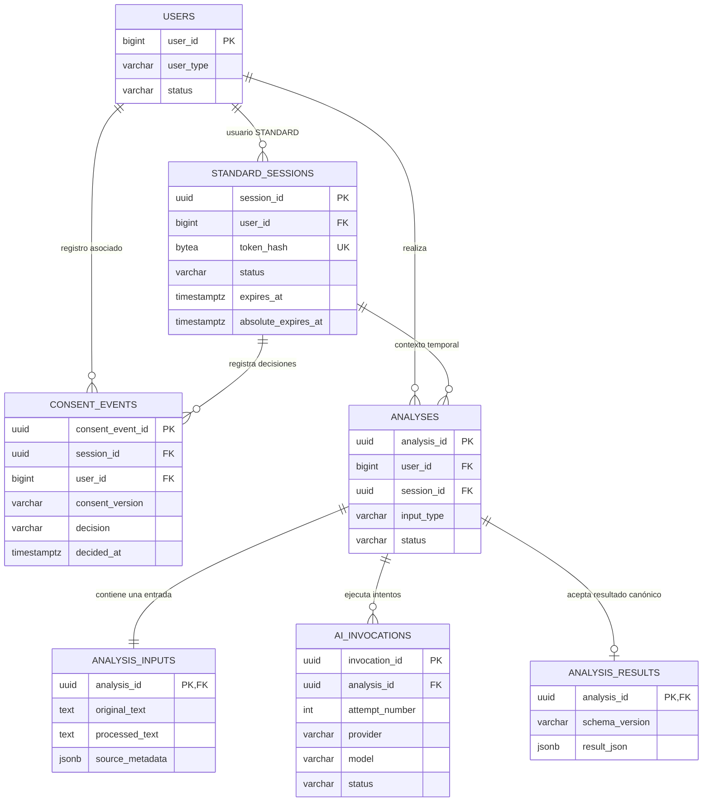
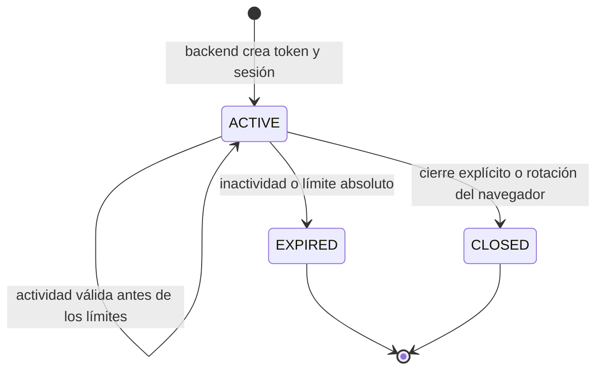
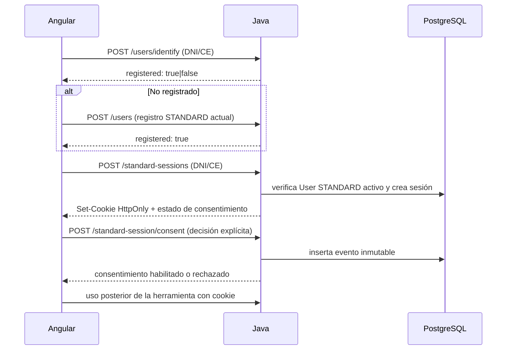
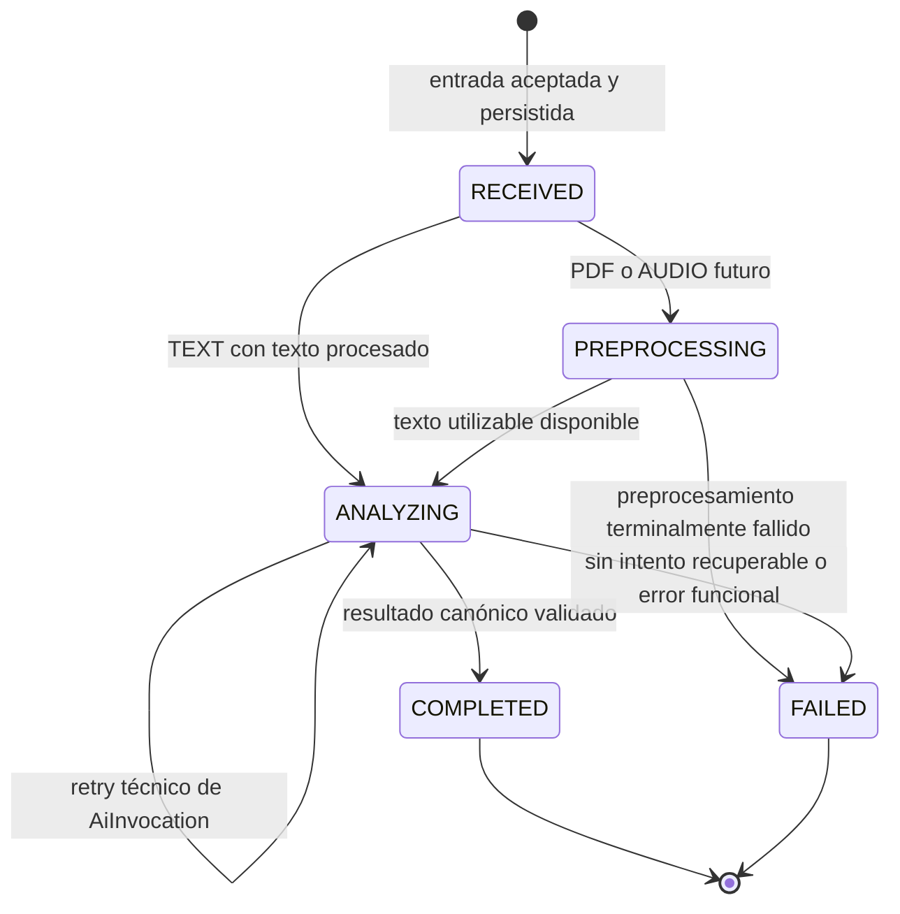

# Dominio de análisis — F1.0

**Estado:** diseño aprobado para revisión humana; no implementado.
**Alcance:** base conceptual para F1.1–F1.4. PDF y audio se incorporarán sobre este modelo en F1.5 y F1.6.

## 1. Objetivo

Definir un núcleo único y trazable para las consultas de propiedad intelectual de usuarios `STANDARD`. El diseño responde cómo se mantiene una experiencia temporal sin convertirla en autenticación, cómo se registra el consentimiento y cómo una consulta conserva su entrada, sus ejecuciones de IA y su resultado funcional.

No se crean entidades, migraciones, rutas, prompts, llamadas a proveedores ni almacenamiento de archivos en F1.0.

## 2. Decisiones confirmadas y límites

- Java/Spring Boot es dueño de la sesión, consentimiento, análisis, persistencia, resultados e integración de IA generativa. Angular solo consume sus contratos; Python solo realizará preprocesamiento técnico futuro de PDF/audio.
- `ADMIN` sigue siendo el único acceso autenticado por credenciales y JWT. `STANDARD` no recibe JWT, no tiene password, perfil ni historial visibles; DNI/CE solo reconoce un registro existente.
- La sesión `STANDARD` es una capacidad temporal de uso, limitada a una experiencia concreta. No verifica identidad, no concede privilegios administrativos ni puede recuperar sesiones o resultados anteriores.
- El motor funcional es IA generativa. No se introducirá un pipeline paralelo de NLP, embeddings, clasificadores, reglas de similitud o ML clásico.
- Se persiste ampliamente la información funcional y técnica necesaria para trazabilidad, evaluación y reproducibilidad razonable. Esto no habilita historial para `STANDARD` ni fija una política productiva de retención.
- El consentimiento de tratamiento de datos y el disclaimer orientativo del resultado son artefactos distintos. El primero habilita el uso; el segundo se mostrará con el resultado en F1.7 y no es una aceptación de datos.

## 3. Diagrama del dominio



`users` es la tabla existente y conserva su PK `BIGINT`. Todas las entidades nuevas que pueden circular fuera de la base o entre componentes internos usarán UUID generados por Java; sus UUID no son credenciales ni sustituyen el token de sesión.

## 4. Sesión temporal STANDARD

### 4.1 Modelo elegido

Una sesión se representará por `StandardSession`, persistida en `standard_sessions`, con PK interna `session_id UUID`. El navegador no recibe ese UUID: recibe un token opaco aleatorio de 256 bits, codificado Base64URL, creado con un generador criptográficamente seguro. El backend conserva solo `HMAC-SHA-256(token, pepper de configuración)` en `token_hash`; el token en claro no se persiste ni se escribe en logs.

La elección separa el identificador de relación (`session_id`) de la capacidad que presenta el navegador. UUID evita la enumeración de relaciones internas expuestas accidentalmente; el token de alta entropía evita que conocer un UUID sea suficiente para usar una sesión.

### 4.2 Transporte del token

Se selecciona una cookie de sesión propia, por ejemplo `IDENTIPAT_STANDARD_SESSION`, en vez de un header con token gestionado por JavaScript.

| Atributo | Decisión conceptual |
| --- | --- |
| `HttpOnly` | Siempre. El frontend no lee ni persiste el token. |
| `Secure` | Siempre en PROD; configurable como `false` solo para HTTP local de DEV. |
| `SameSite` | `Lax` como valor inicial. Angular y Java locales en `localhost` son mismo sitio aunque usen puertos distintos; el frontend debe enviar credenciales y Java debe permitir únicamente orígenes CORS explícitos. |
| `Path` | `/identipat-ia`, el contexto actual del backend. |
| Expiración | `Max-Age` no mayor que el TTL absoluto configurado; el servidor aplica además el timeout por inactividad. |

F1.1 debe definir e implementar una estrategia CSRF explícita para todas las rutas `STANDARD` mutables autorizadas mediante esta cookie. `SameSite` y CORS son defensas complementarias, no sustituyen esa protección. El mecanismo concreto —token CSRF, double-submit cookie, `CookieCsrfTokenRepository` u otro compatible con Angular/Spring Security— se seleccionará durante F1.1 tras revisar la configuración existente. Si un despliegue futuro exige frontend y API en sitios distintos, deberá además habilitar `Secure` y CORS de orígenes concretos; no se cambiará silenciosamente a `SameSite=None`. La cookie no crea una sesión HTTP de Spring Security y `ADMIN` conserva su JWT stateless separado.

El header se descarta porque obliga a exponer el secreto a JavaScript, normalmente mediante memoria persistente, `localStorage` o mecanismos equivalentes, aumentando el impacto de XSS. No se usa un JWT para esta capacidad, para no confundirla con el acceso administrativo ni introducir verificación sin estado que impida revocación inmediata.

### 4.3 Duración y campos

La duración provisional, configurable por ambiente y sin valores hardcodeados en código, es:

- timeout por inactividad: **30 minutos**;
- expiración absoluta desde la creación: **8 horas**.

Treinta minutos limita el uso de una cookie abandonada y ocho horas permite completar una consulta sin interrumpir una jornada razonable. En cada operación permitida el servidor renueva `expires_at` a `min(now + inactivityTimeout, absolute_expires_at)`; puede limitar físicamente las escrituras de `last_activity_at` sin cambiar esa semántica. La cookie nunca se extiende más allá de `absolute_expires_at`.

Campos conceptuales mínimos:

| Campo | Propósito |
| --- | --- |
| `session_id UUID` | PK interna, generada por backend. |
| `user_id BIGINT` | FK al `User` STANDARD activo. |
| `token_hash BYTEA` | HMAC del token, único; nunca el valor en claro. |
| `status` | `ACTIVE`, `EXPIRED` o `CLOSED`. |
| `created_at`, `last_activity_at` | Auditoría y cálculo de inactividad. |
| `expires_at`, `absolute_expires_at` | Vencimiento efectivo y límite no renovable. |
| `closed_at`, `close_reason` | Evidencia de cierre explícito, rotación o invalidación futura. |

Todos los instantes nuevos se almacenarán en UTC con `TIMESTAMPTZ` y se mapearán a `Instant` en Java. La configuración de presentación existente no se modifica en F1.0.

### 4.4 Lifecycle de sesión



- Una validación observa primero el estado y los vencimientos. Si ya venció, marca `EXPIRED` de forma perezosa (un proceso posterior podrá limpiar estados) y borra la cookie en la respuesta; no se acepta la operación.
- Un cierre explícito marca `CLOSED`, registra su instante y borra la cookie. No borra análisis, consentimiento ni sesión.
- Si el mismo navegador se vuelve a identificar con una cookie válida de la misma sesión, el backend la cierra con motivo `ROTATED` y emite una sesión nueva. Si no presenta una cookie válida, abre una nueva sesión independiente; no invalida indiscriminadamente las sesiones de otros navegadores porque DNI/CE no demuestra identidad.
- Abrir una sesión nueva no recupera ni reabre una cerrada o expirada. Un análisis iniciado mientras la sesión era válida puede terminar para trazabilidad, pero queda inaccesible para `STANDARD` cuando esa sesión ya no está vigente.

Esta sesión protege la continuidad limitada de una experiencia y vincula las operaciones al mismo navegador que conserva el token. No protege identidad real, no impide que quien conozca un DNI/CE inicie una experiencia, no da acceso a `ADMIN`, no reemplaza controles contra enumeración del endpoint de reconocimiento y no concede acceso a otras sesiones.

## 5. Flujo STANDARD y consentimiento

### 5.1 Secuencia recomendada



La creación tiene endpoint propio. `POST /users/identify` conserva una responsabilidad mínima: informar existencia. `POST /users` conserva el registro. `POST /standard-sessions` vuelve a verificar DNI/CE contra un `User` `STANDARD` activo, no recibe `userId` del cliente y crea la capacidad temporal. Esta comprobación evita confiar en una respuesta previa de reconocimiento y mantiene separadas identificación, registro y sesión.

### 5.2 Consentimiento conceptual

Se selecciona una bitácora inmutable `consent_events`, no una sola marca mutable de aceptación. Registra tanto `ACCEPTED` como `REJECTED`, porque ambas decisiones explícitas son evidencia útil sin añadir telemetría invasiva. Un análisis solo puede iniciarse cuando el último evento aplicable a la sesión acepta la versión vigente.

Cada sesión exige una aceptación explícita de la versión vigente antes del primer análisis. El evento contiene `consent_event_id UUID`, `user_id`, `session_id`, `consent_version`, `consent_document_hash`, `decision`, `decided_at` y, opcionalmente, `source = STANDARD_WEB`. La evidencia demuestra que una decisión fue registrada desde una sesión temporal asociada al registro `STANDARD` correspondiente. La asociación mediante DNI/CE no constituye autenticación ni verificación criptográfica o presencial de que quien usa el navegador sea la persona titular real del documento. No se almacenan IP, geolocalización, user-agent ni device fingerprint: no son necesarios para probar la decisión funcional y su recolección amplía datos personales/técnicos sin justificación actual.

El backend es la fuente de la versión y hash del texto vigente; el valor enviado por el cliente se valida contra esa versión para detectar una pantalla desactualizada. Un rechazo se persiste, no permite análisis y conduce al cierre de la sesión para evitar una experiencia ambigua. Para cambiar de decisión, la persona inicia una nueva sesión y acepta de forma explícita. El disclaimer de resultados no se modela como `consent_event`.

## 6. Aggregate principal: Analysis

`Analysis` representa **una consulta funcional iniciada por la persona**, sin importar si la fuente es `TEXT`, `PDF` o `AUDIO`. No habrá tres entidades de análisis. Su PK es `analysis_id UUID`, que sí puede exponerse como referencia opaca de consulta, siempre acompañada de la validación de la sesión vigente; el UUID por sí solo nunca autoriza lectura.

Campos conceptuales de `analyses`:

| Campo | Nulabilidad y semántica |
| --- | --- |
| `analysis_id UUID` | PK, no nulo. |
| `user_id BIGINT` | No nulo; usuario asociado para trazabilidad interna. |
| `session_id UUID` | No nulo; sesión bajo la cual se autorizó el inicio. Permanece válida como referencia aun después de vencer. |
| `input_type` | No nulo: `TEXT`, `PDF` o `AUDIO`. |
| `status` | No nulo; lifecycle de la sección 10. |
| `created_at` | No nulo; recepción persistida. |
| `started_at` | Nulo hasta que inicia procesamiento. |
| `completed_at` | Nulo salvo éxito terminal. |
| `failed_at` | Nulo salvo error terminal. |
| `failure_code`, `failure_message` | Nulos salvo fallo funcional; mensaje saneado, sin stack trace ni secretos. |

Una regeneración solicitada explícitamente por la persona crea una nueva `Analysis`, pues es una nueva consulta funcional. Los reintentos automáticos y respuestas inválidas del proveedor permanecen dentro de la misma `Analysis` como varias `AiInvocation`.

## 7. Datos de entrada

Se selecciona una tabla 1:1 `analysis_inputs` con `analysis_id` como PK y FK. Separarla de `analyses` mantiene la fila de estado liviana, evita que campos voluminosos condicionen consultas operativas y admite sin rediseño los tres tipos de entrada.

| Campo | Uso |
| --- | --- |
| `analysis_id` | PK/FK de la consulta. |
| `original_text TEXT` | Texto exactamente enviado por la persona para `TEXT`; para PDF/audio queda nulo si la fuente original es archivo. |
| `processed_text TEXT` | Texto final que Java entrega al proveedor; para `TEXT` puede ser la normalización permitida y para PDF/audio será extracción/transcripción futura. |
| `source_metadata JSONB` | Metadata evolutiva y no sensible en exceso: por ejemplo, tipo lógico, nombre declarado, MIME declarado, tamaño y versión del preprocesamiento. |
| `created_at`, `processed_at` | Trazabilidad de disponibilidad de entrada. |

Para `TEXT`, `original_text` se conserva sin reescritura y `processed_text` identifica de modo inequívoco lo enviado a IA. Para PDF/audio no se define aún objeto storage, tabla de archivos, OCR, STT ni formatos; F1.5/F1.6 decidirán el manejo del original y completarán metadata y texto procesado. El análisis sigue teniendo una sola fila de entrada.

## 8. Invocaciones de IA

`AiInvocation` modela cada llamada técnica al proveedor y se separa de `Analysis`: una consulta puede reintentarse, agotar un timeout, cambiar de modelo o producir una salida no válida antes de concluir. Tiene `invocation_id UUID` y FK no nula a `analysis_id`.

| Campo | Tipo conceptual y propósito |
| --- | --- |
| `attempt_number` | Entero positivo, único por análisis, asignado en orden. |
| `provider`, `model` | Columnas normales agnósticas de proveedor. El proveedor inicial previsto es Gemini, sin columnas exclusivas de Gemini. |
| `prompt_version`, `prompt_template_hash` | Identificador lógico y hash SHA-256 de la plantilla versionada. |
| `rendered_prompt_snapshot`, `rendered_prompt_hash` | Snapshot exacto enviado y su hash para auditoría/reproducibilidad. |
| `prompt_variables JSONB` | Variables no redundantes usadas para renderizar; el texto de entrada se referencia en `analysis_inputs` y no se duplica sin necesidad. |
| `request_parameters JSONB` | Parámetros del modelo agnósticos, como temperatura o límites, cuando apliquen. |
| `raw_provider_response JSONB` | Payload semánticamente crudo devuelto por el proveedor; si fuera texto no JSON, se encapsula como valor JSON. |
| `structured_provider_response JSONB` | Interpretación estructurada previa a la validación canónica. |
| `token_usage JSONB`, `total_token_count` | Usage completo específico de proveedor y total normalizado si este lo informa. |
| `latency_ms`, `finish_reason` | Métrica frecuente y finalización reportada. |
| `status`, `error_code`, `error_message` | Estado técnico y diagnóstico saneado. |
| `created_at`, `completed_at` | Instantes de inicio y término del intento. |

Estados mínimos de `AiInvocation`: `STARTED`, `SUCCEEDED`, `FAILED`, `TIMED_OUT`, `INVALID_RESPONSE`. Solo los últimos cuatro son terminales. `error_code` es un catálogo evolutivo y no contiene stack traces. `raw_provider_response` puede existir también en `INVALID_RESPONSE` si hubo respuesta, y nunca se expone a `STANDARD`.

### 8.1 Versionado de prompts y reproducibilidad

F1.2 versionará prompts en el repositorio. Cada invocación guardará: versión lógica, referencia/hash de la plantilla, hash del prompt renderizado, snapshot renderizado exacto y variables no derivables. Así se puede responder qué se ejecutó aunque un archivo posterior cambie.

El snapshot puede contener el texto de la consulta; por ello pertenece a datos de dominio con acceso restringido, nunca a logs ordinarios. La duplicación se acepta por la decisión de trazabilidad amplia, pero deberá someterse a las reglas futuras de retención y anonimización. Esta evidencia permite reproducibilidad razonable, no determinismo: proveedores, modelos externos y parámetros de muestreo pueden cambiar con el tiempo.

## 9. Resultado canónico

`AnalysisResult` es el resultado funcional estructurado que Java valida y acepta, separado de la respuesta cruda y de la respuesta estructurada del proveedor. Se selecciona `analysis_results` 1:1 con `analyses`, usando `analysis_id` como PK/FK, `schema_version`, `result_json JSONB` y `created_at`.

La separación evita sobrecargar `analyses`, permite indexar/validar el contrato de resultado independientemente del lifecycle y distingue claramente salida de proveedor de resultado de negocio. Una vez completada la consulta, el resultado es inmutable. Una regeneración explícita es otra `Analysis`; intentos técnicos previos se auditan en `ai_invocations`.

El envelope inicial es estable y se valida antes de persistir:

```text
AnalysisResult
├── schemaVersion
├── summary
├── patentabilityAssessment
│   ├── conclusion
│   ├── explanation
│   └── references[]
├── protectionOptions[]
│   ├── type
│   ├── relevance
│   └── rationale
├── observations[]
└── warnings[]
```

`patentabilityAssessment.conclusion` representa una conclusión orientativa, no una decisión oficial ni una probabilidad calibrada. F1.4 definirá su vocabulario jurídico y referencias/criterios concretos. No se agregará un porcentaje numérico de confianza por defecto. `protectionOptions[].type` prevé `INVENTION_PATENT`, `UTILITY_MODEL`, `INDUSTRIAL_DESIGN`, `DISTINCTIVE_SIGNS`, `COPYRIGHT` y `OTHER`; `relevance` será una escala cualitativa (`HIGH`, `MEDIUM`, `LOW`) que F1.4 validará en detalle. `warnings[]` contiene exclusivamente advertencias derivadas de la entrada o del diagnóstico, como información insuficiente, ambigüedad o necesidad de describir un componente; no contiene el disclaimer institucional.

El disclaimer institucional no depende de Gemini ni de contenido libre generado por el modelo, no se persiste por defecto dentro de `warnings[]` y será contenido controlado y versionado por la aplicación en F1.7.

`schema_version` se guarda como columna para filtros e integridad y se repite como `schemaVersion` en JSON. Se adopta versionado semántico del envelope, por ejemplo `analysis-result/1.0`: adiciones compatibles incrementan el minor; cambios de significado, obligatoriedad o forma incrementan el major. Java valida que ambos valores coincidan. Lectores deben tolerar campos opcionales desconocidos dentro de su major; una versión mayor requiere adaptador/contrato nuevo. No se sobrescribe resultado histórico para “migrarlo”.

## 10. Lifecycle de Analysis y errores



`COMPLETED` y `FAILED` son terminales. `RECEIVED` existe desde que se acepta una consulta válida y persistible. `started_at` se fija al primer paso de procesamiento; `completed_at` solo al éxito y `failed_at` solo al fallo. Para texto, `PREPROCESSING` se omite. Un retry no retrocede ni reinicia `Analysis.status`; crea el siguiente `AiInvocation` y mantiene `ANALYZING`. Cuando se supera la política de reintentos o el caso ya no es recuperable, se registra el código funcional y se pasa a `FAILED`.

Los errores se separan en dos niveles:

| Nivel | Ejemplos | Persistencia |
| --- | --- | --- |
| `Analysis` funcional | `INVALID_INPUT`, `PREPROCESSING_FAILED`, `AI_PROVIDER_UNAVAILABLE`, `AI_TIMEOUT`, `INVALID_AI_RESPONSE`, `INTERNAL_ERROR` | Código y mensaje saneado terminales de la consulta. |
| `AiInvocation` técnico | timeout del intento, respuesta de contrato inválida, error de red, error devuelto por proveedor | Estado, código, mensaje saneado, latencia y payload disponible. |

Una validación HTTP elemental, como un body vacío, puede responder `400` sin crear una `Analysis`. Si una entrada ya persistida no resulta procesable, se marca la `Analysis` como `FAILED` con `INVALID_INPUT` u otro código apropiado. Stack traces, secretos, cookies y cuerpos sin saneamiento no son datos de negocio.

## 11. Persistencia: columnas y JSONB

PostgreSQL sigue siendo la fuente de persistencia. Se normalizan relaciones, estados, fechas, identificadores, tipo de entrada, proveedor/modelo, versión/hash de prompt, conteos/timing frecuentes y códigos de error. Son datos por los que se filtra, agrupa, controla integridad u opera el procesamiento.

JSONB se reserva para estructuras evolutivas y específicas de proveedor: `source_metadata`, `prompt_variables`, `request_parameters`, `raw_provider_response`, `structured_provider_response`, `token_usage` y `result_json`. No se transforma toda la base en JSON. Se crea un índice GIN sobre JSONB solo cuando una consulta de reporte concreta lo justifique; no se preoptimiza en F1.1–F1.3.

### 11.1 Tablas futuras propuestas

| Tabla | Propósito, PK y FKs | Campos/JSONB principales | Índices y constraints conceptuales | Fase |
| --- | --- | --- | --- | --- |
| `standard_sessions` | Sesión temporal. PK `session_id UUID`; `user_id` FK a `users`. | Token HMAC, estado, instantes de vencimiento/cierre. | `token_hash` único; `user_id`; `expires_at`; `status`; `expires_at > created_at`; solo User STANDARD activo por regla de servicio. | F1.1 |
| `consent_events` | Evidencia inmutable de decisiones. PK UUID; relación compuesta con sesión/usuario. | Versión, hash del documento, decisión, instante. | índice `(session_id, decided_at DESC)` y `user_id`; decisión permitida; no update/delete de negocio. | F1.1 |
| `analyses` | Consulta funcional. PK UUID; relación compuesta `(session_id, user_id)` con sesión. | Tipo, estado, lifecycle y fallo funcional. | índices `(session_id, created_at DESC)`, `(user_id, created_at DESC)`, `(status, created_at)`; estados y transiciones validadas por aplicación. | F1.3 |
| `analysis_inputs` | Entrada 1:1. PK/FK `analysis_id`. | Textos original/procesado y `source_metadata`. | FK única por PK; invariantes por `input_type` en aplicación. | F1.3; ampliada F1.5/F1.6 |
| `ai_invocations` | Intentos técnicos. PK UUID; `analysis_id` FK. | Prompt, proveedor/modelo, payloads, usage, timing y error. | único `(analysis_id, attempt_number)`; índices `analysis_id`, `(provider, model, created_at)`. | F1.2/F1.3 |
| `analysis_results` | Resultado canónico 1:1. PK/FK `analysis_id`. | `schema_version`, `result_json`, instante. | una sola fila por análisis; validar coincidencia de versión columna/JSON en aplicación. | F1.3/F1.4 |

Para preservar que el usuario de una sesión coincide con quien figura en consentimiento y análisis, `standard_sessions` tendrá una clave única adicional `(session_id, user_id)` y `consent_events`/`analyses` usarán una FK compuesta sobre ese par. Así se evita una asociación cruzada de `session_id` y `user_id` aun cuando ambas columnas se mantengan para trazabilidad y consultas internas.

No se diseña `ON DELETE CASCADE` desde `users`: destruiría evidencia y trazabilidad. Para un usuario que tenga sesiones, consentimientos, análisis u otra evidencia histórica asociada, la dirección funcional preferida es la **desactivación lógica** del registro y la conservación de esas relaciones; no el borrado físico en cascada. La estrategia propuesta para esas FKs es `RESTRICT`.

Anonimización de PII, derecho de eliminación, retención, condiciones excepcionales de borrado físico y el tratamiento futuro del endpoint ADMIN actual quedan para gobierno de datos/producción. La operación administrativa de borrado existente requerirá una adaptación futura y no se cambia en F1.0.

## 12. Trazabilidad, privacidad y logging

Para cada consulta válida será posible relacionar usuario, sesión, tipo/original/procesado de entrada, proveedor/modelo, prompt exacto, parámetros, intentos, respuestas de proveedor, resultado canónico, uso de tokens, latencia y errores. El acceso a esos datos será interno y autorizado; F1.0 no diseña aún un panel administrativo.

La base de dominio no se sustituye por logs. Los logs operativos no deben imprimir textos de entrada, prompts, respuestas completas, resultado completo, token de sesión, hash de token, secretos ni API keys. Podrán usar IDs correlacionables (`analysis_id`, `invocation_id`) y códigos de error. Las decisiones definitivas de cifrado, retención, minimización, anonimización, borrado y acceso administrativo quedan para gobierno de datos antes de producción.

## 13. Matriz de decisiones

| Decisión | Alternativas | Selección | Justificación | Fase implementación |
| --- | --- | --- | --- | --- |
| Mecanismo de sesión | Cookie opaca; header; JWT | Cookie HttpOnly con token opaco | Reduce exposición a JavaScript y permite revocación server-side. | F1.1 |
| Almacenamiento de token | Texto; hash lento; HMAC/pepper | HMAC-SHA-256 con pepper, único | Permite lookup seguro y no guarda el secreto presentable. | F1.1 |
| TTL | Solo absoluto; solo inactividad; ambos | 30 min inactividad + 8 h absoluto configurables | Equilibra exposición de cookie abandonada y continuidad de uso. | F1.1 |
| Creación de sesión | Incluirla en identify/registro; endpoint propio | `POST /standard-sessions` separado | Mantiene reconocimiento y registro sin efectos de sesión. | F1.1 |
| Consentimiento | Flag mutable; solo aceptaciones; eventos | Eventos `ACCEPTED`/`REJECTED` por sesión | Evidencia trazable sin datos técnicos innecesarios. | F1.1 |
| CSRF para STANDARD | Solo SameSite/CORS; token; double-submit; repositorio Spring | Estrategia CSRF explícita obligatoria; mecanismo por definir | Las rutas mutables usan cookie y requieren una defensa CSRF específica; ADMIN JWT permanece separado. | F1.1 |
| PK nuevas entidades | BIGINT; UUID | UUID, salvo resultado 1:1 que usa `analysis_id` | No enumerables y consistentes para referencias internas/externas. | F1.1–F1.3 |
| Analysis/Input | Tres análisis; campos en Analysis; tabla 1:1 | Un `Analysis` + `analysis_inputs` 1:1 | Unifica fuente y desacopla contenido voluminoso/evolutivo. | F1.3 |
| Invocaciones IA | Campos en Analysis; tabla separada | `ai_invocations` 1:N | Conserva retries, timeouts y respuestas inválidas. | F1.2/F1.3 |
| Resultado canónico | Texto libre; JSONB en Analysis; tabla 1:1 | `analysis_results` 1:1 con JSONB | Separa contrato de negocio, lifecycle y proveedor. | F1.3/F1.4 |
| JSONB | Todo normalizado; todo JSON; mixto | Columnas para operación + JSONB evolutivo | Preserva integridad y admite payloads variables. | F1.1–F1.4 |
| Lifecycle | Solo éxito/error; cinco estados | `RECEIVED`, `PREPROCESSING`, `ANALYZING`, `COMPLETED`, `FAILED` | Cubre texto y futuras entradas sin complejidad excesiva. | F1.3 |
| Ejecución | Síncrona; asíncrona con broker; asíncrona DB | Asíncrona durable sin broker inicial | Estabiliza UX ante LLM/PDF/audio y tolera reinicios con recuperación. | F1.3 |
| Endpoints de entrada | Endpoint genérico; rutas por tipo | `/analyses/text`, `/analyses/pdf`, `/analyses/audio` | JSON y multipart conservan contratos claros con dominio interno único. | F1.3/F1.5/F1.6 |
| Prompt | Solo versión; hash; snapshot | Versión + hashes + snapshot renderizado + variables | Responde qué prompt exacto produjo una salida. | F1.2 |
| Respuesta IA cruda | No guardar; columna texto; JSONB | JSONB por invocación | Auditoría agnóstica de proveedor sin contaminar resultado canónico. | F1.2/F1.3 |
| Uso de tokens | No guardar; JSONB; columnas | JSONB + total normalizado cuando exista | Preserva detalles de proveedor y permite métricas frecuentes. | F1.2/F1.3 |
| Archivos originales | Definir almacenamiento ya; omitir; diferir | Diferir almacenamiento físico y retención | Corresponde a F1.5/F1.6 y gobierno de datos. | F1.5/F1.6/F2.1 |
| Usuario con evidencia histórica | Borrado físico; cascade; desactivación lógica | Desactivación lógica y conservación | Evita destruir sesiones, consentimientos, análisis e invocaciones trazables. | Dirección F1.1–F2.1; endpoint ADMIN futuro |

## 14. Sincronía vs asincronía

Se selecciona el contrato **asíncrono durable** desde F1.3: el `POST` persiste la `Analysis` y devuelve `202 Accepted` con `analysisId` y estado `RECEIVED`; un `GET` recupera su estado o resultado. Una llamada LLM puede tener latencia variable, y PDF/audio añadirán preprocesamiento: responder síncronamente volvería frágil el timeout HTTP y exigiría rediseño posterior de UX/API.

F1.3 no introducirá Kafka, Redis, Celery ni una dependencia de cola solo para este caso. La implementación deberá persistir el estado antes de ejecutar, usar un ejecutor acotado de Spring y recuperar en el arranque las consultas no terminales según una política documentada de reintento. Por ello un reinicio no deja una consulta en memoria sin evidencia. El detalle de concurrencia y recuperación se implementará y probará en F1.3, no en F1.0.

| Alternativa | Ventajas | Riesgos | Decisión |
| --- | --- | --- | --- |
| Síncrona | Menos rutas y polling inicialmente. | Timeout, UX bloqueada y cambio futuro para PDF/audio. | Descartada. |
| Asíncrona con broker externo | Mayor capacidad de escala. | Dependencia y operación prematuras. | Diferida hasta que exista necesidad. |
| Asíncrona durable en PostgreSQL + ejecutor acotado | API estable, persiste recuperación y no añade infraestructura. | Requiere diseñar recuperación y límites. | Seleccionada para F1.3. |

## 15. Decisiones diferidas

- Política productiva de retención, minimización, anonimización, cifrado, derecho de eliminación, condiciones de borrado físico y acceso administrativo detallado.
- Contenido jurídico, taxonomía final de conclusiones, criterios/referencias y cualquier indicador cualitativo de certeza (F1.4).
- Archivos originales, object storage, límites, MIME, OCR, transcripción y contratos de Python para PDF/audio (F1.5/F1.6).
- Implementación concreta del proveedor/SDK, política de retry, límites de costo y catálogo final de errores (F1.2/F1.3).
- Protección anti-enumeración, rate limiting y hardening operativo (F2.2). La estrategia CSRF para rutas STANDARD basadas en cookie es obligatoria en F1.1; solo el mecanismo concreto queda por elegir.
- Visualización del disclaimer, reporte web/PDF y su versionado de presentación (F1.7).

Estas decisiones diferidas no requieren rediseñar `Analysis`, su entrada 1:1 ni la separación de `AiInvocation` y `AnalysisResult`.
